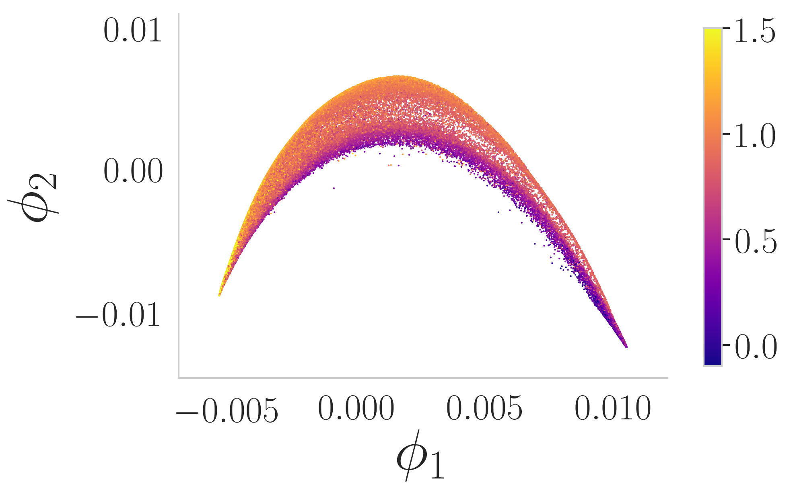
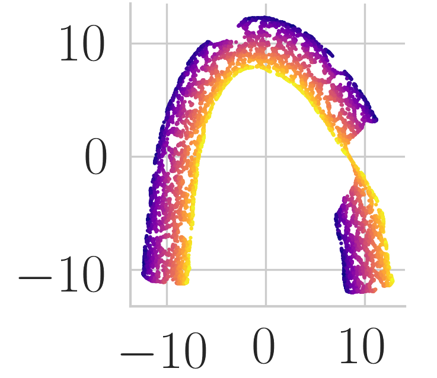
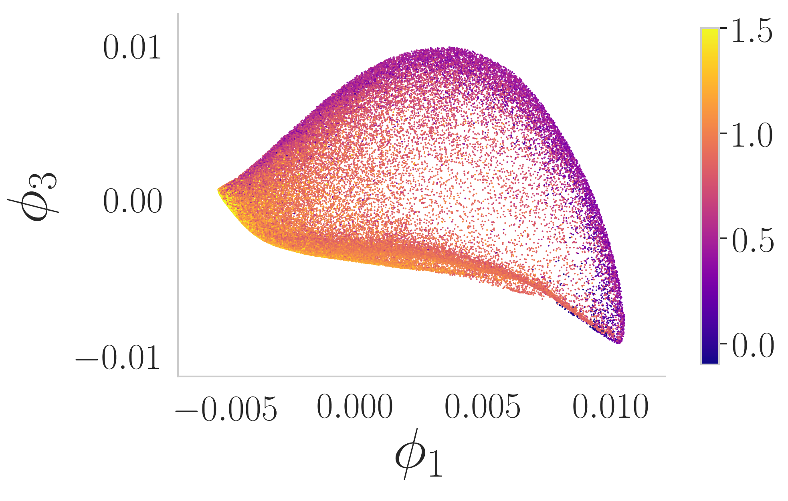
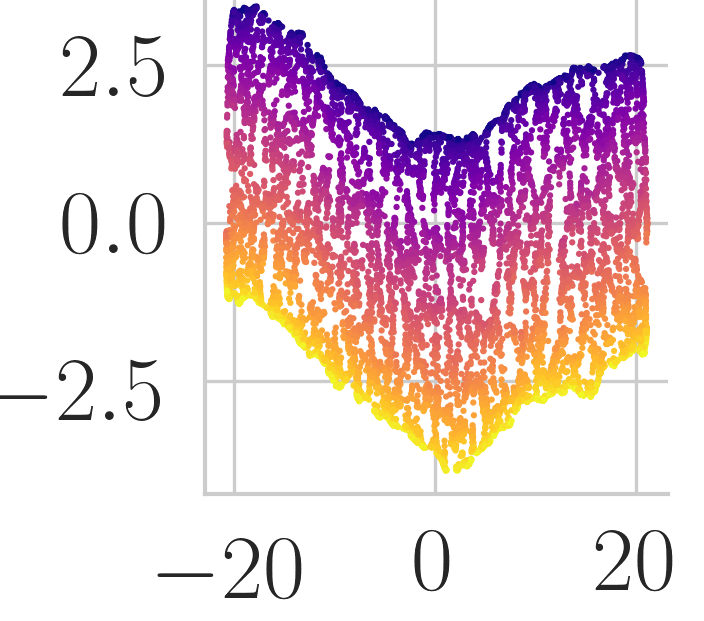

The effect of manifold aspect ratio: seeing "horseshoes" everywhere
====================================================================

> Hangliang Ren, Murray Kang, Qirui Wang, Yujia Wu, Marina Meila

Below is an embedding of a real data set, spectra of galaxies in $D=3750$ dimensions (described <a href="https://arxiv.org/abs/1603.02763">here</a> or <a href="https://www.jmlr.org/papers/v17/16-109.html">here</a>), and embedded by <a href="https://proceedings.neurips.cc/paper/2019/hash/6a10bbd480e4c5573d8f3af73ae0454b-Abstract.html">this paper</a> with DiffusionMaps, into $m=2$ dimensions. Next to it is an embedding of a synthetic data set, a rectangle with length $7\times$ width by UMAP. This paper <a href="https://projecteuclid.org/journals/annals-of-applied-statistics/volume-2/issue-3/Horseshoes-in-multidimensional-scaling-and-local-kernel-methods/10.1214/08-AOAS165.full">Horeshoes in multidimensional scaling and local kernel methods</a> presents an embedding of the <a href="https://archive.ics.uci.edu/ml/datasets/Congressional+Voting+Records">UCI Congressional voting records data</a> $D=16$ in $m=2$ dimensions with an algorithm called *Multi-Dimensional Scaling (MDS)*. All these embeddings look like horseshoes, but for the last 2 cases *we know* that there is no horseshoe in the data (the congressional data is approximately one-dimensional, with the congressmen ordered by degree of partisanship, plus significant noise). Thus the horseshoe  is an *artefact* of the algorithm used. What is causing it?

 

Fortunately, horseshoes are easily recognized. Below we show the simple fix, for a more sophisticated algorithm look at <a href="https://proceedings.neurips.cc/paper/2019/hash/6a10bbd480e4c5573d8f3af73ae0454b-Abstract.html">Selecting the independent coordinates of manifolds with large aspect ratios </a>.

 

What is aspect ratio? 
---------------------
Below we see two examples of rectangles with different *aspect ratios*. For the left rectangle, the aspect ratio $a=4/3$, representing its length over  and  for the right rectangle it is $a=8/1.9=4.21$ (we avoid choosing aspect ratios that are integers). 

Below we see data sampled uniformly from these 2 rectangles.

Aspect ratio can be defined for other simple manifolds, that can be obtained by "rolling up" these rectangles. 

Two Swiss Rolls. The aspect ratio is inherited from the original rectangles (left $a=4/3$, right $a=8/1.9=4.21$ ).

Two Tori. A torus is a rectangle that is first rolled up (and glued) into a tube, then rolled again to form a tubular ring. The aspect ratio is then the ratio of the original rectangle, equal to the ratio of the larger and smaller radii of the torus (left $R/r=4/3$, right $R/r=8/1.9=4.21$). 

These manifolds all have *intrinsic dimension* $d=2$, because they are obtained by a transformation of a rectangle, which is itself a 2 dimensional manifold. Even though they are 2 dimensional manifold, the torus and swiss roll live in $m=3$ coordinates, and we call $m$ the *embedding dimension*. Of course not all manifolds are obtained from rectangles. Qualitatively, we think of the aspect ratio of a manifold as the aspect ratio of the data, after the manifold is "unfolded" in $d$ dimensions. 

Most real data is not generated from rectangles, but most real data, when unfolded, has aspect ratio $>2$, in other words, not close to 1. The following examples illustrate how this affects the embeddings produced by different embedding algorithms. 

Before embarking on the examples, the readers are invited to take a detour dealing with the question: what is a good embedding? And what isn't?

*a table with links to subsets of results*

Rectangle
---------

The rectangle is the simplest manifold example. The embedding algorithm will map _input data_  $(x_1,x_2)$ sampled from rectangles to points in $m=2$ with _embedding coordinates_ denoted $(v_0,v_1)$. In other words, we aren't even trying to "reduce dimension", as the data is already "embedded" in 2D. But the algorithms do not know it, and we will have the opportunity to observe their behavior.

The $v$ notation for embedding coordinates is motivated by the fact that most embedding algorithms use the eigenvectors of a matrix as embedding coordinates (Isomap, SpectralEmbedding, LLE). The UMAP algorithm starts with coordinates obtained by eigenvectors, which are then post-processed; t-SNE is the only method that does not use eigendecomposition. 

**Uniform Density**

| ML algo | 1.33         | 2.5       | 3.16 | 4.21 | 5.26 | 8.42 | 10.53 | 15.79 |
| :---                        |    :----:   |   :---: |   :----:    |   :----:    |    :----:    |    :----:    |    :----:    |    :----:    | 
| Isomap |||||||||
| Spectral |||||||||
| LLE     | |  |  |  |  |  |  |  |
| UMAP    |  |  |  |  |  |  |  |  |

*The best single plot for different aspect ratio* **TODO: add a second row with the eigenvectors chosen in each case**

| ML algo | 1.33         | 2.5       | 3.16 | 4.21 | 5.26 | 8.42 | 10.53 | 15.79 |
| :---                        |    :----:   |   :---: |   :----:    |   :----:    |    :----:    |    :----:    |    :----:    |    :----:    | 
| UMAP    |  |  |  |  |  |  |  |  |

Swiss roll
----------
A swiss roll is just a rectangle rolled up. So, the embedding algorithms should output the same results as before, since they are getting the essentially same data, right? This pretty much what we observe. (At a more careful examination, we see that one end of the swiss roll is sometimes more stretched than the other. This is an effect of the sampling density, which is *not exaclty uniform*. When we generate our swiss rolls, the dark (blue) points get denser, because they are in the inner part of the spiral, while the light (yellow) points become sparser. As we will discuss in more detail [here --to be written shortly --](variable-density.md), some ML algorithms can be sensitive to the non-uniformity of the samples.]

**Uniform Density**

| ML algo | 1.33         | 2.5       | 3.16 | 4.21 | 5.26 | 8.42 | 10.53 |
| :---                        |    :----:   |   :---: |   :----:    |   :----:    |    :----:    |    :----:    |    :----:    |
| Isomap     |  |  |  |  |  |  |  |
| Spectral    |  |  |  |  |  |  |  |
| LLE     |  |  |  |  |  |  |  |
| UMAP    |  |  |  |  |  |  |  |

*The best single plot for different aspect ratios*

| ML algo | 1.33         | 2.5       | 3.16 | 4.21 | 5.26 | 8.42 | 10.53 |
| :---                        |    :----:   |   :---: |   :----:    |   :----:    |    :----:    |    :----:    |    :----:    |
| UMAP    |  |  |  |  |  |  |  |

**Variable Density**

| ML algo | 1.33         | 2.5       | 3.16 | 4.21 | 5.26 | 8.42 | 10.53 |
| :---                        |    :----:   |   :---: |   :----:    |   :----:    |    :----:    |    :----:    |    :----:    |
| UMAP    |  |  |  |  |  |  |  |

Rectangle with hole
-------------------
Because ML algorithms are "myopic", and only see small neighborhoods around each point, creating a hole in the data complicates their work. Some of the challenges are minor; for example, there are multiple ways to map the data that are approximately the same -- this is what causes Isomap to "round the hole". This effect will disappear gradually with more densely sampled data. Other challenges are more serious: a long rectangle with a hole is in fact *the union of 4 long rectangles*! 

**Uniform Density**

| ML algo | 1.33         | 2.5       | 3.16 | 4.21 | 5.26 | 8.42 | 10.53 | 15.79 |
| :---                        |    :----:   |   :---: |   :----:    |   :----:    |    :----:    |    :----:    |    :----:    |    :----:    | 
| Isomap     |  |  |  |  |  |  |  |  |
| Spectral     |  |  |  |  |  |  |  |  |
| LLE     |  |  |  |  |  |  |  |  | 
| UMAP    |  |  |  |  |  |  |  |  | 

*The best single plot for different aspect ratio*

| ML algo | 1.33         | 2.5       | 3.16 | 4.21 | 5.26 | 8.42 | 10.53 | 15.79 |
| :---                        |    :----:   |   :---: |   :----:    |   :----:    |    :----:    |    :----:    |    :----:    |    :----:    | 
| UMAP    |  |  |  |  |  |  |  |  |

Torus
-----

| ML algo | 1.33         | 2.5       | 3.16 | 4.21 | 5.26 | 8.42 |
| :---                        |    :----:   |   :---: |   :----:    |   :----:    |    :----:    |    :----:    |
| Isomap     |  |  |  |  |  |  | 
| Spectral     |  |  |  |  |  |  | 
| LLE     |  |  |  |  |  |  | 
| UMAP    |  |  |  |  |  |  |

*The best single plot for different aspect ratios*

| ML algo | 1.33         | 2.5       | 3.16 | 4.21 | 5.26 | 8.42 |
| :---                        |    :----:   |   :---: |   :----:    |   :----:    |    :----:    |    :----:    |
| UMAP    |  |  |  |  |  |  |

+ single plot of best embedding (aspect ratio x alg )
+ 1-2 complete examples

**Variable Density**

| ML algo | 1.33         | 2.5       | 3.16 | 4.21 | 5.26 | 8.42 |
| :---                        |    :----:   |   :---: |   :----:    |   :----:    |    :----:    |    :----:    |
| UMAP    |  |  |  |  |  |  |

A manifold with $d=3$ 
---------------------
(brick?, ellipsoid? swiss roll?)

A "cute" manifold
------------------

Explanation, diagnosis, and what to do
---------------------------------------

For all ML algorithms presented here, the $m$ embedding coordinates are eigenvectors of a matrix. We would like each of them to represent an independent coordinate, but, in reality, the picture is more complex. If we compute many more than $m$ eigenvectors, we see that some or the higher order eigenvectors are harmonics of the preceding ones.

[Here, v1, v2 and v5 are harmonics of v0, and v4 is a harmonic of v3](https://github.com/mk322/manifold-learning-examples/blob/main/aspect-ratio-plots/Spectral-megaman/SwissRoll/Swiss_Roll_a10b4_Spectral_phi.jpg)

The larger the aspect ratio, the more harmonics of v0, the first eigenvector, will be found immediately following v0.

If we select harmonics among our embedding coordinate, the observed dimension of the embedding is *smaller than $d$, the intrinsic dimension. This is the main diagnostic that the **Independent Eigenvector Selection** (this is how we call our goal in technical terms) has not succeeded. In fact, if the dimension observed is not equal to $d$ everywhere, the embedding *has failed*. For simple cases, the drop in dimension happens everywhere (see above), for more complicated manifolds, it can happen only on parts of the data.

###What to do?

We must search among the eigenvectors, from lower orders to higher, for a set of $m$ that preserve $d$ everywhere. When the manifold becomes more difficult (thinner, closer to itself) we may *need to increase $m$, the number of embedding coordinates* -- as shown by Johanthan Bates here [The embedding dimension of Laplacian eigenfunction maps](https://arxiv.org/abs/1605.01643).

Further reading and examples with real data 
--------------------------------------------

<a href="https://proceedings.neurips.cc/paper/2019/hash/6a10bbd480e4c5573d8f3af73ae0454b-Abstract.html">Selecting the independent coordinates of manifolds with large aspect ratios </a> discusses the problems in the case of Spectral Embedding (the authors have experimented with other algorithms such as LTSA and UMAP as well, observing similar behaviors) and proposes a solution, while <a href="https://projecteuclid.org/journals/annals-of-applied-statistics/volume-2/issue-3/Horseshoes-in-multidimensional-scaling-and-local-kernel-methods/10.1214/08-AOAS165.full">Horeshoes in multidimensional scaling and local kernel methods</a> does the same for MDS. In [Parsimonious representation of nonlinear dynamical systems through manifold learning: A chemotaxis case study](https://www.sciencedirect.com/science/article/pii/S1063520315000949) describe the aspect ratio problem for ML algorithm, and introduce the name **Independent Eigenvector Selection** and a first algorithm to correct it. 

Contributions
--------------
*MK* ;*MM* concept, main text, references; *HR*; *QW*; *YW* .

