## Manifold Learning (ML) / Embedding explained  (in progress)

We all know and love *Principal Components Analysis (PCA)* the workhorse of *linear* dimension reduction. It's universally accepted, understood, reproducible. But when they turn to *non-linear dimension reduction*, the newcomers' first impression is one of chaos: so many choices of algorithms, of parameters, and each output different results for the same data!

Here we what we can expect and ask of an embedding algorithm (and what we should not), what is a "good embedding" (and how to diagnose a failed one), why the variations one sees are unavoidable, being baked into the ML paradigm (at least apparently), and how to still make sense of the valuable tools ML offers. 

(from smooth_embedding.md)

When is an embedding "good"? How to evaluate the output of a manifold learning (embedding) algorithm?

Unrolling the Swissroll
=======================

*Figures: Swissroll 8/1.9 | rectangle 8/1.9 |
A swissroll and the original data before rolling. Ideally, the ML algorithm should recover the original data, or a good approximation of it. Consider the embeddings below. Which ones look "correct" to you and which ones don't? Try to explain to yourself why.

  
  
  
  
  

Local deformations
==================
Now, what should we mean by a _good approximation_? (For a more 
formal mathematical definition of _embedding_ see these videolectures).

Clearly, a rigid translation or rotation of the original data sh
ould be acceptable. We may also find acceptable some _small defo
rmations_ of the data. This last concept needs refinement.

*examples needed here -- to take from one of the non-embeddings 
above*

### No metric:

|  |  |  |  |  |  |
|:---:|:---:|:---:|:---:|:---:|:---:|
| Isomap | LE | LLE | LTSA | UMAP | t-SNE |

### With metric:

|  |  |  |  |  |  |
|:---:|:---:|:---:|:---:|:---:|:---:|
| Isomap | LE | LLE | LTSA | UMAP | t-SNE |

### Radius cut:

|  |  |  |  |  |  |
|:---:|:---:|:---:|:---:|:---:|:---:|
| Isomap | LE | LLE | LTSA | UMAP | t-SNE |

### China map example:

| 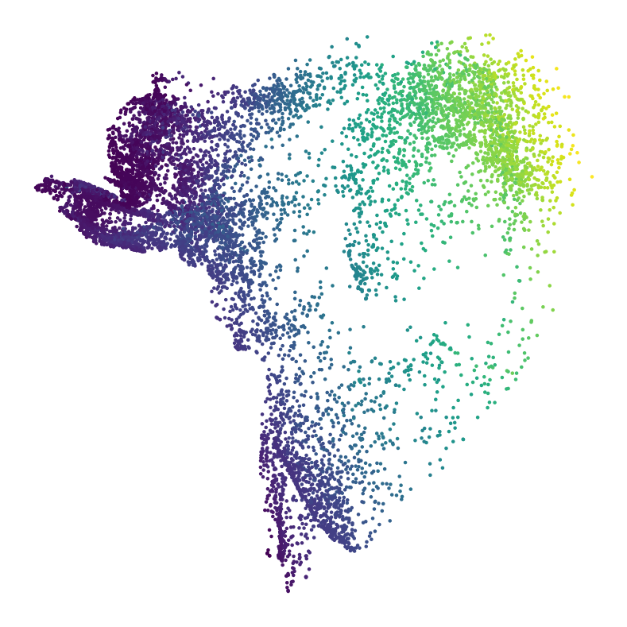 | 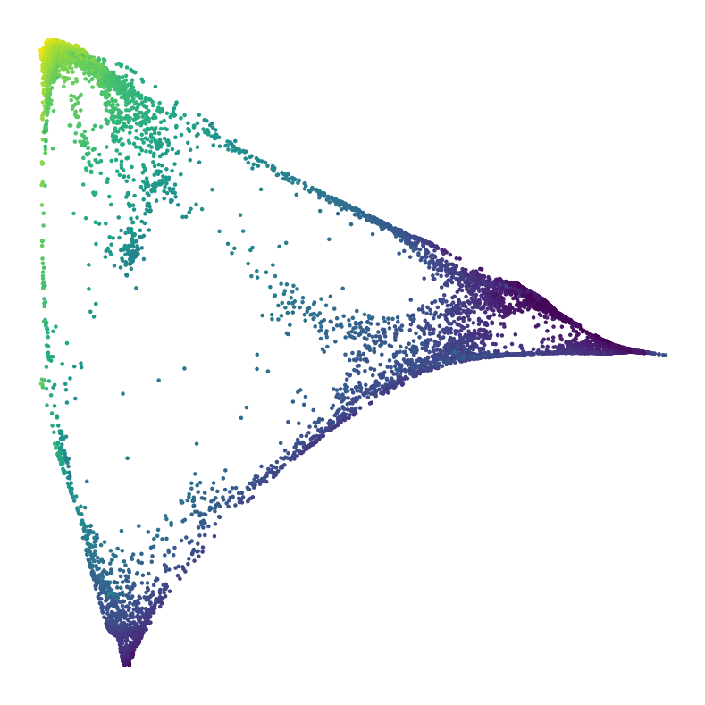 | 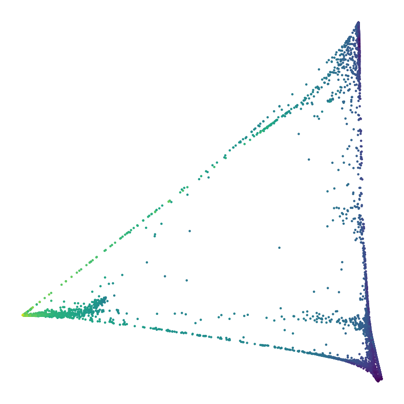 | 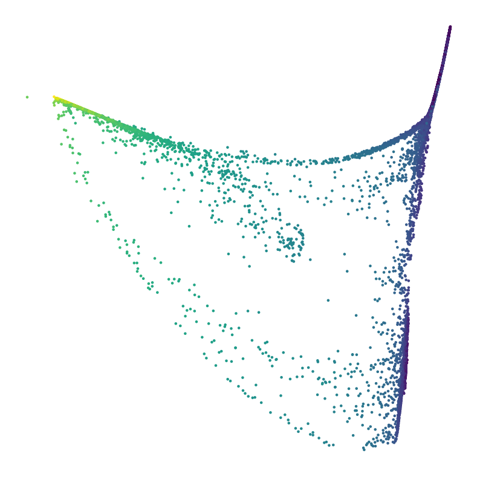 | 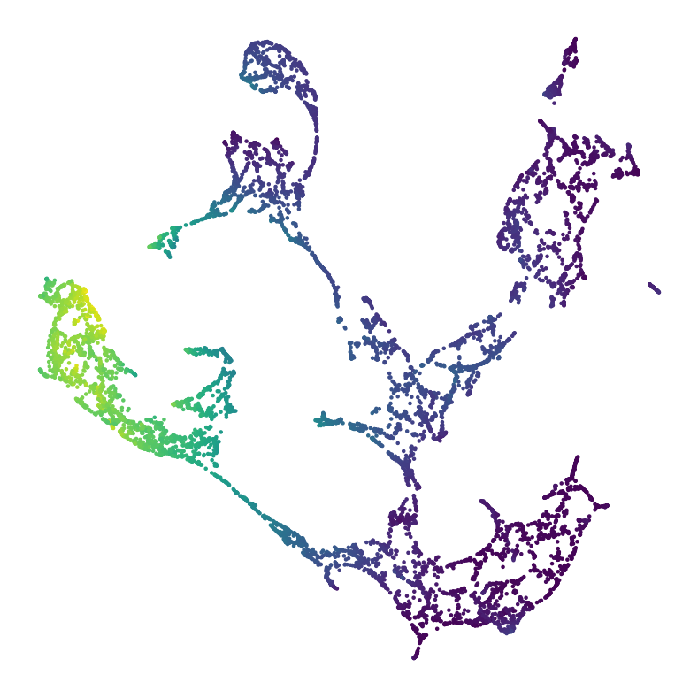 | 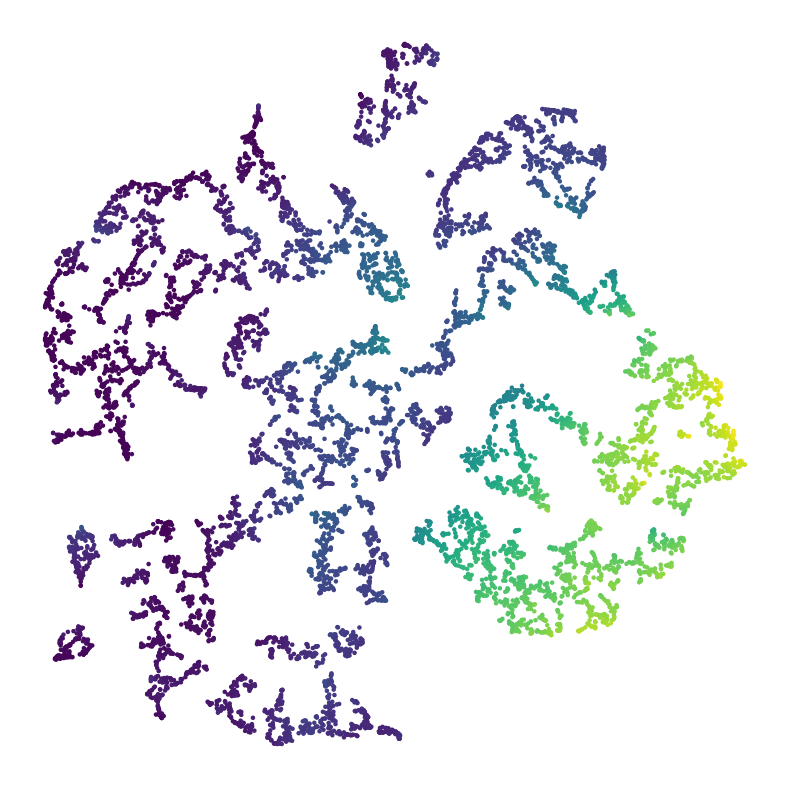 |
|:---:|:---:|:---:|:---:|:---:|:---:|
| Isomap | LE | LLE | LTSA | UMAP | t-SNE |

| 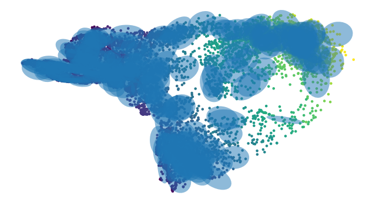 | 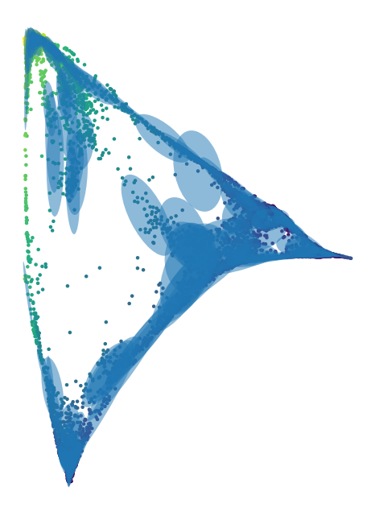 | 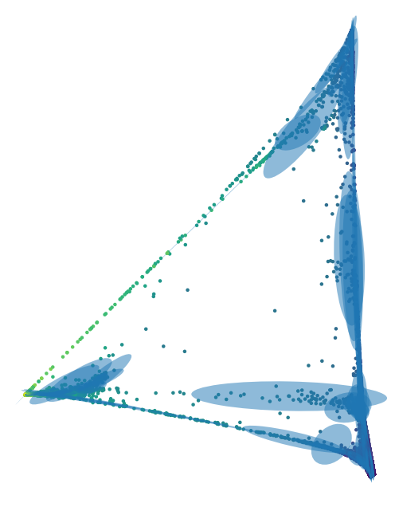 | 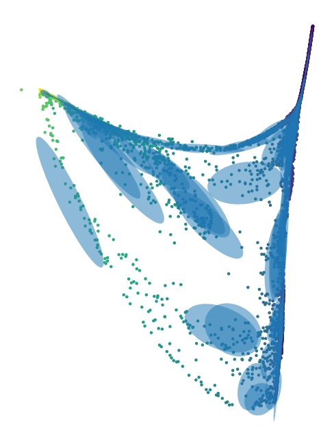 | 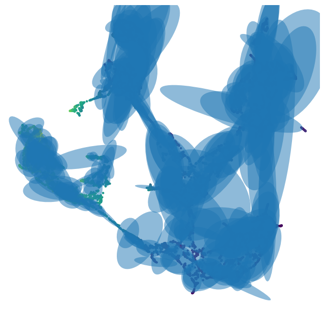 | 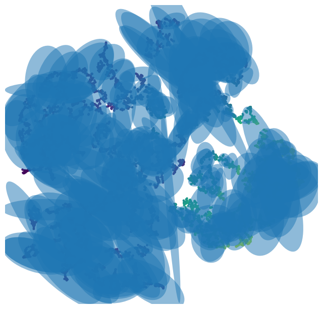 |
|:---:|:---:|:---:|:---:|:---:|:---:|
| Isomap | LE | LLE | LTSA | UMAP | t-SNE |

### Torus examples:

|  |  |  |  |  | 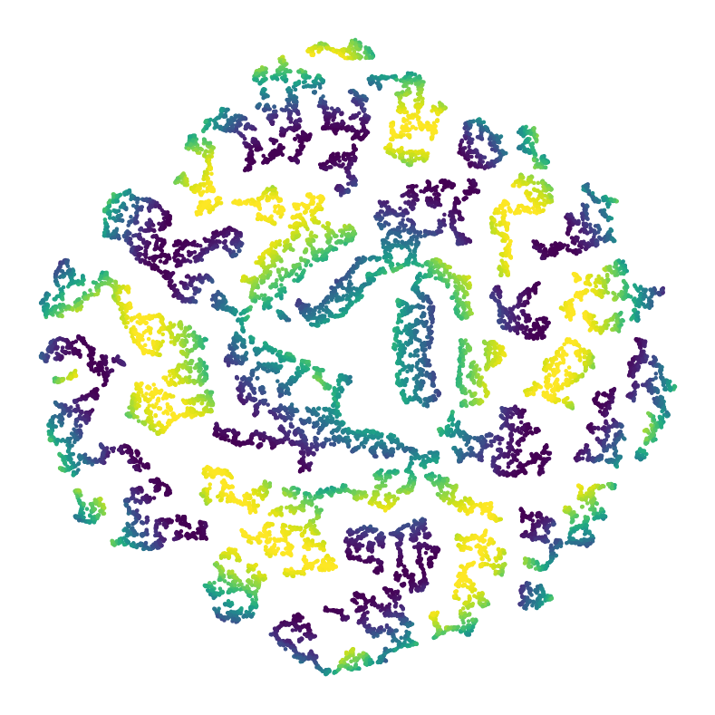 |
|:---:|:---:|:---:|:---:|:---:|:---:|
| Isomap | LE | LLE | LTSA | UMAP | t-SNE |

|  |  |  |  |  | 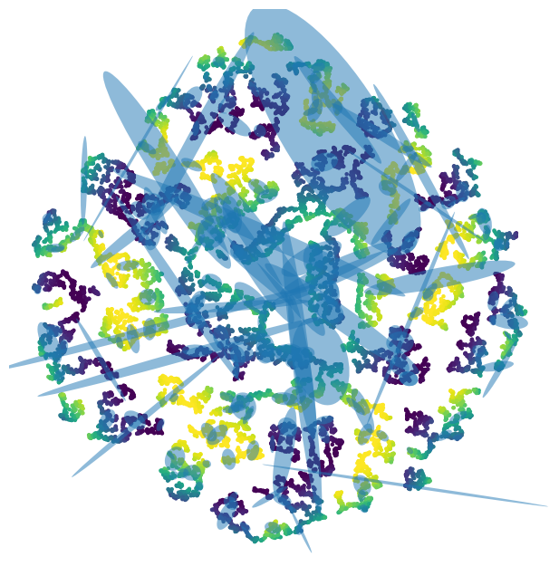 |
|:---:|:---:|:---:|:---:|:---:|:---:|
| Isomap | LE | LLE | LTSA | UMAP | t-SNE |

### Jupyter Nodebook for previous examples:
[Open the Jupyter Notebook](Review-figures.ipynb)

No matter how a ML algorithm works, its input is always a description of the _local neighborhoods_ of the data points. Typically, for each data point $i$, the distances to $i$'s neighbors are 
the input. The _neighbors_ are either the $k$-nearest neighbors 
in the data, or all the points with distance $\leq r$ from $i$.

Since the local information is all that the ML algorithm has access to, it is natural that it preserves the _intrinsic_ structure/shape of the data (the rectangle, in the case of the Swissroll) but not the _ambient_ strucuture and shape (e.g. how the rectangle was rolled and in how many dimensions).  

So, when we talk about dis
