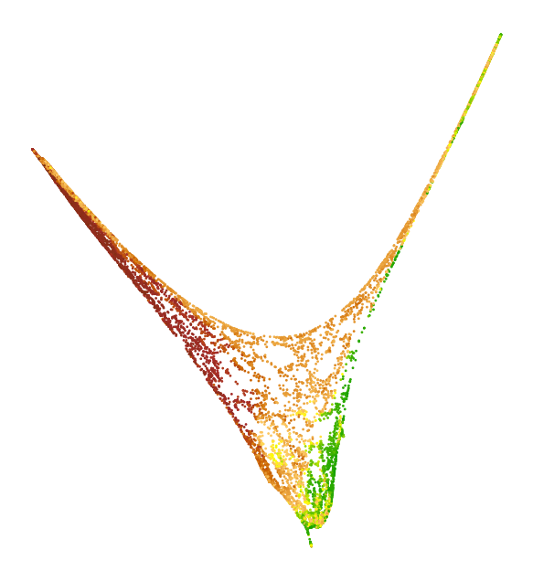
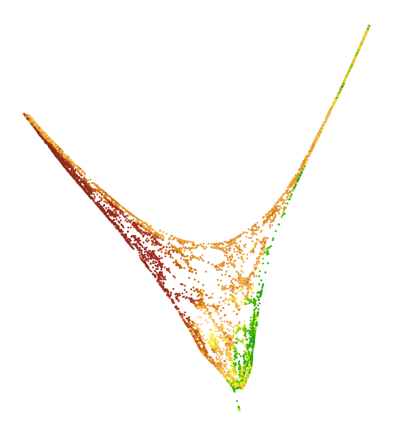

## Manifold Learning (ML) / Embedding explained  (in progress)

We all know and love *Principal Components Analysis (PCA)* the workhorse of *linear* dimension reduction. It's universally accepted, understood, reproducible. But when they turn to *non-linear dimension reduction*, the newcomers' first impression is one of chaos: so many choices of algorithms, of parameters, and each output different results for the same data!

Here we what we can expect and ask of an embedding algorithm (and what we should not), what is a "good embedding" (and how to diagnose a failed one), why the variations one sees are unavoidable, being baked into the ML paradigm (at least apparently), and how to still make sense of the valuable tools ML offers. 

(from smooth_embedding.md)

When is an embedding "good"? How to evaluate the output of a manifold learning (embedding) algorithm?

Unrolling the Swissroll
=======================

*Figures: Swissroll 8/1.9 | rectangle 8/1.9 |
#### Swissroll 3d data 

  

A swissroll and the original data before rolling. Ideally, the ML algorithm should recover the original data, or a good approximation of it. Consider the embeddings below. Which ones look "correct" to you and which ones don't? Try to explain to yourself why.

  
  
  
  
  

Local deformations
==================
Now, what should we mean by a _good approximation_? (For a more 
formal mathematical definition of _embedding_ see these videolectures).

Clearly, a rigid translation or rotation of the original data sh
ould be acceptable. We may also find acceptable some _small defo
rmations_ of the data. This last concept needs refinement.

In the example of the SwissRoll, all we had to do to map data from 3 dimensions down to its intrinsic dimension $d=2$ was to unroll the rectangular strip. This can be done without cutting the strip, and even without stretching it. We say that the embedding is _isometric_

## Cut Torus 
Let us now take the _CutTorus_   _figure of cut torus here, and of sample from it.

   

This manifold also has $d=2$, clearly, so we should be able to represent it in 2 dimensions. But this is not possible without stretching the Cut Torus to flatten it on the plane. This is what the embeddings by different algorithms look like. 

|  |  |  |  |  |  |
|:---:|:---:|:---:|:---:|:---:|:---:|
| Isomap | LE | LLE | LTSA | UMAP | t-SNE |

None of the embeddings are isometric, but some look definitely more deformed than others. _More comments here on topology preserving_  We can measure how much and in what direction the manifold was distorted using the _(Reciprocal) Push-Forward Riemannian Metric_ $H$. _cite location in course here_ Here we will  call the (Reciprocal) Push-Forward Riemannian Metric something simpler, the _distortion_, or _local distortion_, or _distortion matrix_. Indeed $H$ is a $2\times 2$ symmetric positive definite matrix. The plots below show the directions of its 2 eigenvectors as the axes of an ellipse; the length of each axis is the respective eigenvalue. If there is no distortion, the eigenvalues are both equal to 1, and $H$ displays like a circle. This can be seen in the Isomap detail plot as the middle ellipse. 

|  |  |  |  |  |  |
|:---:|:---:|:---:|:---:|:---:|:---:|
| Isomap | LE | LLE | LTSA | UMAP | t-SNE |

Details of the same embeddings. As expected, if the middle line of the Cut Torus is preserved undistorted, then the inner and outer borders must be stretched to fit on a plane.

|  |  |  |  |  |  |
|:---:|:---:|:---:|:---:|:---:|:---:|
| Isomap | LE | LLE | LTSA | UMAP | t-SNE |

## Torus
_figure of torus here_

The Torus is a manifold that could be the outer surface of a bagel (without the interior). Thus, it has the same intrinsic dimension as the Cut Torus above, $d=2$. But, unlike the Cut Torus, no amount of stretching can let us map the torus to a plane (this is true about the sphere too). Of course, one can make a cut in the torus, in which case it will become a Cut Torus, which can be embedded in the plane. Or we can simply imagine putting a big weight on top if it, and outright flattening it down to the plane _figure here? something funny_  Here _to include link_ we explain how these operations on the Torus differ from what is called embedding. 

The only thing to do is to map the Torus to more dimensions than $d$, namely to $m=3$ dimensions; $m$ is called the _embedding dimension_. Isn't mapping from 3 to 3 dimensions pointless? Yes, in real life it would be quite pointless to take this torus and "reduce dimension"; but many times, such a torus can exist in a space with many more dimensions; those other dimensions would be quite useless, but we humans can't see it directly. An algorithm like PCA, or the embedding algorithms shown here removes the extra dimensions to let us see the data shape. 

|  |  |  |  |  |  |
|:---:|:---:|:---:|:---:|:---:|:---:|
| Isomap | LE | LLE | LTSA | UMAP | t-SNE |

|  |  |  |  |  |  |
|:---:|:---:|:---:|:---:|:---:|:---:|
| Isomap | LE | LLE | LTSA | UMAP | t-SNE |

#### Torus 3d visualization for different embeddings:
|  |  |  |  |  |  |
|:---:|:---:|:---:|:---:|:---:|:---:|
| Isomap | LE | LLE | LTSA | UMAP | t-SNE |

### Jupyter Nodebook for Swiss Roll, Cut Torus and Torus examples:
[Open the Jupyter Notebook](Review-figures.ipynb)

### China map example: 
_this example will be moved to a post of its own_

SIMPLE test for push request!!!

|  |  |  |  |  |  |
|:---:|:---:|:---:|:---:|:---:|:---:|
| Isomap | LE | LLE | LTSA | UMAP | t-SNE |

|  |  |  |  |  |  |
|:---:|:---:|:---:|:---:|:---:|:---:|
| Isomap | LE | LLE | LTSA | UMAP | t-SNE |

How do embedding algorithms work?
=================================

No matter how a ML algorithm works, its input is always a description of the _local neighborhoods_ of the data points. Typically, for each data point $i$, the distances to $i$'s neighbors are 
the input. The _neighbors_ are either the $k$-nearest neighbors 
in the data, or all the points with distance $\leq r$ from $i$.

Since the local information is all that the ML algorithm has access to, it is natural that it preserves the _intrinsic_ structure/shape of the data (the rectangle, in the case of the Swissroll) but not the _ambient_ strucuture and shape (e.g. how the rectangle was rolled and in how many dimensions).  

So, when we talk about dis
