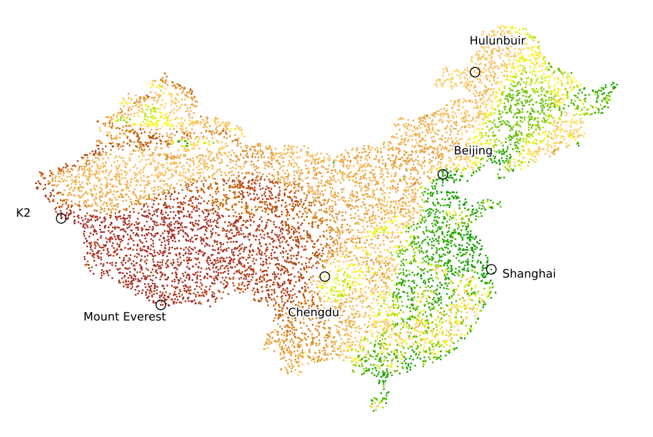

## Shape A (United States of America)

### Original Map

  
  

### Embeddings
|  |  |  |  |  |  |
|:---:|:---:|:---:|:---:|:---:|:---:|
| **Isomap** | **LE** | **LLE** | **LTSA** | **t-SNE** | **UMAP** |

---

## Shape B (Part of Europe)

### Original Map

  
  

### Embeddings
|  |  |  |  |  |  |
|:---:|:---:|:---:|:---:|:---:|:---:|
| **Isomap** | **LE** | **LLE** | **LTSA** | **t-SNE** | **UMAP** |

---

## Shape C (China)

### Original Map

  
  

### Embeddings
|  |  |  |  |  |  |
|:---:|:---:|:---:|:---:|:---:|:---:|
| **Isomap** | **LE** | **LLE** | **LTSA** | **t-SNE** | **UMAP** |

<!-- |  |  |  |  |  |  |
|:---:|:---:|:---:|:---:|:---:|:---:|
| Isomap | LE | LLE | LTSA | UMAP | t-SNE |

|  |  |  |  |  |  |
|:---:|:---:|:---:|:---:|:---:|:---:|
| Isomap | LE | LLE | LTSA | UMAP | t-SNE | -->

---

### Map Image Credits

- **East Asia Topographic Map** by [Ksiom](https://commons.wikimedia.org/wiki/User:Ksiom) Licensed under [CC BY-SA 3.0](https://creativecommons.org/licenses/by-sa/3.0/) and [GFDL 1.2+](https://www.gnu.org/licenses/old-licenses/fdl-1.2.html) [View Image](https://upload.wikimedia.org/wikipedia/commons/thumb/2/26/East_Asia_topographic_map.png/500px-East_Asia_topographic_map.png)

- **US Painted Relief Map** by [Kmusser](https://commons.wikimedia.org/wiki/User:Kmusser) Public domain [View Image](https://upload.wikimedia.org/wikipedia/commons/thumb/5/50/Uspaintedrelief.png/500px-Uspaintedrelief.png)

- **Europe Topography Map** by [San Jose](https://commons.wikimedia.org/wiki/User:San_Jose) Licensed under [CC BY-SA 3.0](https://creativecommons.org/licenses/by-sa/3.0/) and [GFDL 1.2+](https://www.gnu.org/licenses/old-licenses/fdl-1.2.html) [View Image](https://upload.wikimedia.org/wikipedia/commons/thumb/3/38/Europe_topography_map_en.png/1000px-Europe_topography_map_en.png)
