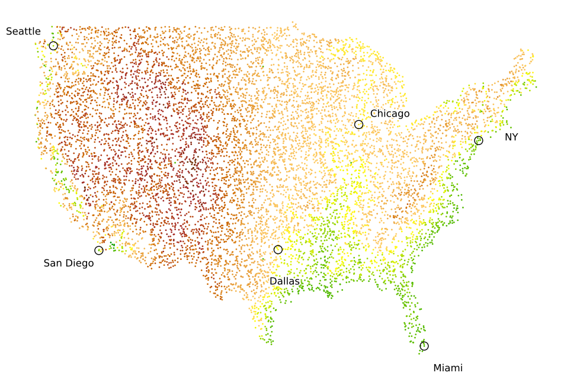

## Shape A (United States of America)

### Original Map

  
  

### Embeddings
|  |  |  |  |  |  |
|:---:|:---:|:---:|:---:|:---:|:---:|
| **Isomap** | **LE** | **LLE** | **LTSA** | **t-SNE** | **UMAP** |

---

## Shape B (Part of Europe)

### Original Map

  
  

### Embeddings
|  |  |  |  |  |  |
|:---:|:---:|:---:|:---:|:---:|:---:|
| **Isomap** | **LE** | **LLE** | **LTSA** | **t-SNE** | **UMAP** |

---

## Shape C (China)

### Original Map

  
  

### Embeddings
|  |  |  |  |  |  |
|:---:|:---:|:---:|:---:|:---:|:---:|
| **Isomap** | **LE** | **LLE** | **LTSA** | **t-SNE** | **UMAP** |

<!-- |  |  |  |  |  |  |
|:---:|:---:|:---:|:---:|:---:|:---:|
| Isomap | LE | LLE | LTSA | UMAP | t-SNE |

|  |  |  |  |  |  |
|:---:|:---:|:---:|:---:|:---:|:---:|
| Isomap | LE | LLE | LTSA | UMAP | t-SNE | -->
